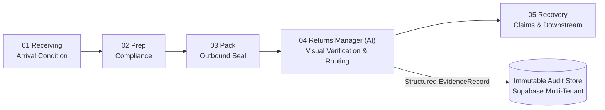
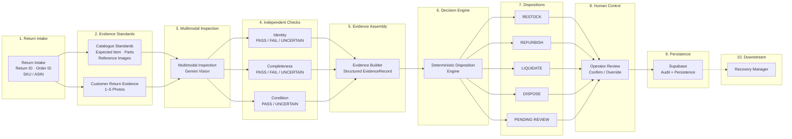
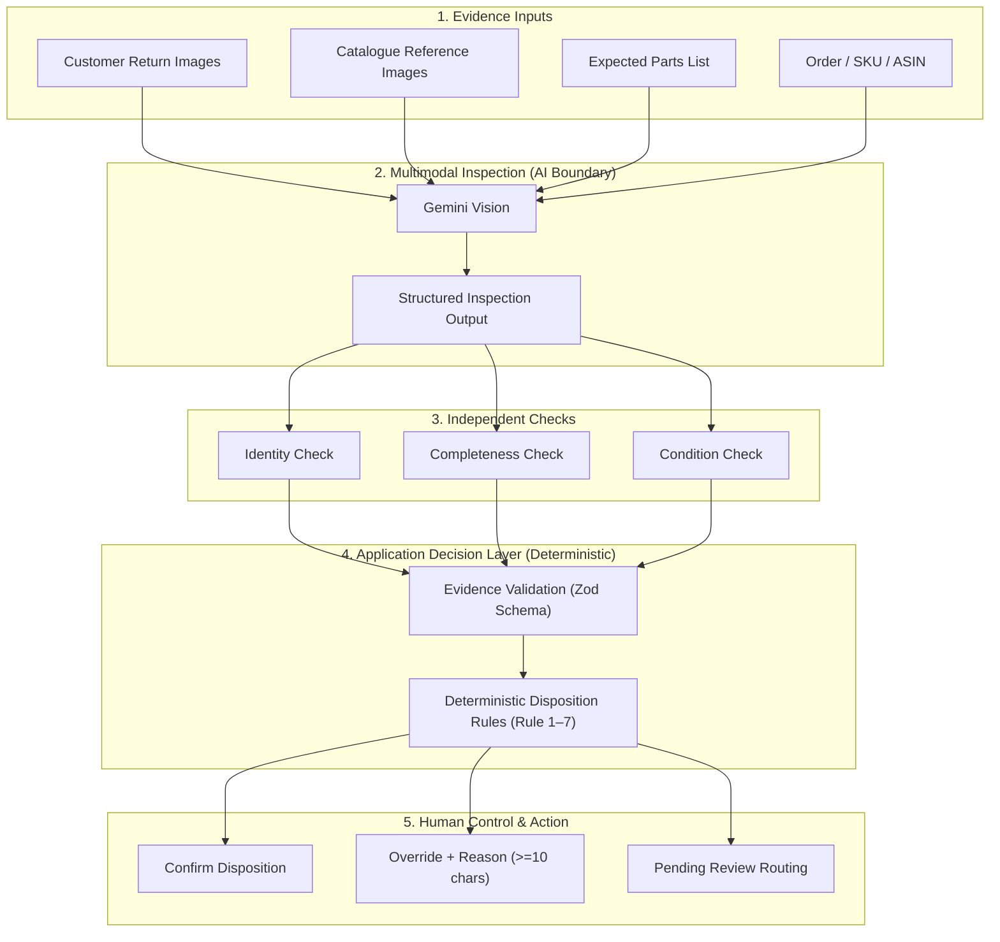
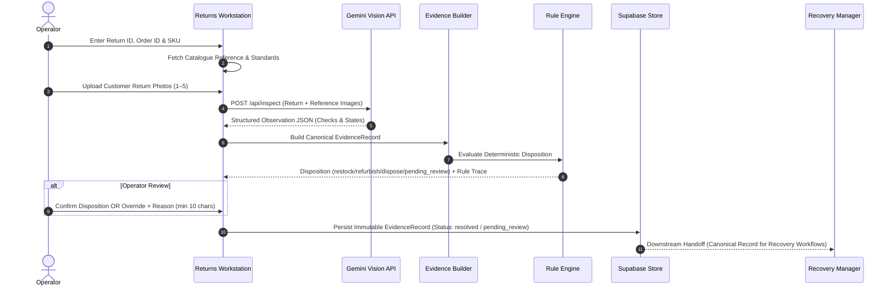
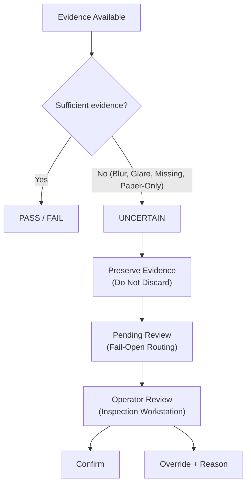
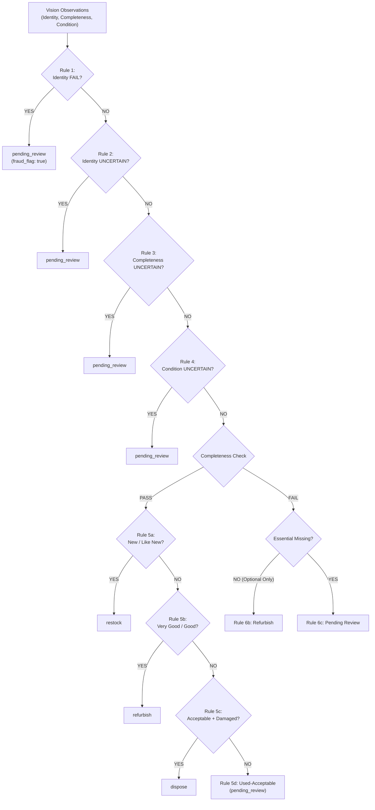
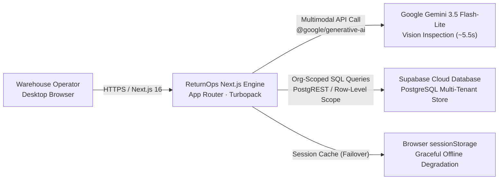

# ReturnOps AI — System Architecture & Technical Specification

**Cube Buildathon · Step 4 of 5: Returns Manager (`cube26_returns_manager_04`)**

> **Overview:**  
> ReturnOps AI automates customer returns inspection. Google Gemini (`gemini-3.5-flash-lite`) is used to inspect physical return photos against seller catalogue standards across Identity, Completeness, and Condition. Dispositions (`restock`, `refurbish`, `liquidate`, `dispose`, `pending_review`) are assigned deterministically by a TypeScript rules engine rather than having the LLM make business decisions. Each inspection produces an immutable, SHA-256 hashed `EvidenceRecord` saved to Supabase with tenant isolation, ready for downstream recovery workflows.

---

## 1. System Boundary & Position in Chain

ReturnOps AI is the **Returns Manager** in the Cube26 5-stage operational returns chain. It receives physical return parcels, validates them against catalogue standards, records observable physical evidence, and executes deterministic routing.

- **Upstream Input:** Customer return parcels, return shipment tracking, and order identifiers.
- **Internal Standards:** Catalogue specifications, component checklists, and catalogue reference standards.
- **Downstream Consumer:** **Recovery Manager** consumes the structured `EvidenceRecord` for downstream recovery workflows.

---

## 2. End-to-End System Architecture

The end-to-end architecture links return intake, reference binding, multimodal vision, deterministic rules, human oversight, and downstream recovery:

---

## 3. The AI Boundary Architecture

ReturnOps AI separates AI visual inspection from business disposition logic. Gemini is used to observe the return images; application rules determine the disposition.

### Boundary Responsibilities:

| Subsystem | Component | Responsibility | Technology |
| :--- | :--- | :--- | :--- |
| **Inputs** | Catalogue & Photo Intake | Bind SKU metadata, required/optional parts, and catalogue reference photos. | Next.js API Routes / Local Catalog |
| **AI Sensor** | Gemini 3.5 Flash-Lite | Multi-image visual comparison, label reading, and physical defect observation. | `@google/generative-ai` (single structured call) |
| **Validation** | Zod Schemas | Strict type enforcement, bounds checking, and schema parsing. | `zod` (`src/lib/schemas.ts`) |
| **Decision** | Disposition Engine | Pure rule evaluation, priority hierarchy, rule trace generation. | TypeScript (`src/lib/disposition-engine.ts`) |
| **Oversight** | Warehouse Workstation | Visual side-by-side inspection, confirmation, override audit. | React 19 (`src/app/results/`) |
| **Audit** | Supabase Persistence | Multi-tenant storage, SHA-256 canonical hashing, audit logging. | PostgreSQL / Row-Scoped Supabase Client |

---

## 4. Evidence Lifecycle & Data Flow

Every return inspection executes an end-to-end trace from physical arrival to downstream recovery readiness:

---

## 5. Independent Checks & Semantic Verdicts

Inspection evaluations are strictly partitioned into three independent checks to avoid cross-check contamination:

### 1. Identity Check
- **Purpose:** Verifies whether the returned physical item matches the SKU / ASIN ordered.
- **Verdicts:**
  - `PASS`: Branding, form factor, labels, and silkscreens match catalogue standards.
  - `FAIL`: Wrong product, wrong model generation, wrong color variant, or counterfeit item detected.
  - `UNCERTAIN`: Barcode torn, label obscured, or photo quality too poor to confirm identity.

### 2. Completeness Check
- **Purpose:** Verifies all factory accessories, cables, manuals, and adapters against the catalogue parts list.
- **Verdicts:**
  - `PASS`: Base item and all bundled parts present, OR verified complete via **Factory-Sealed Package Inference** (unopened manufacturer packaging / shrinkwrap or intact tamper wafer).
  - `FAIL`: Missing essential component (e.g. charging case, AC adapter) or missing non-essential accessory (e.g. auxiliary cable, quick-start guide).
  - `UNCERTAIN`: Accessories concealed inside closed opaque packaging or out of camera frame.

### 3. Condition Assessment
- **Purpose:** Evaluates cosmetic wear and physical integrity using authoritative Amazon condition grading.
- **Verdicts:** `PASS` (with Amazon grade) or `UNCERTAIN` (when evidence is insufficient to assess condition).
- **Amazon 5-Tier Rubric (when PASS):**
  - `New`: Pristine factory seal, or open box with all factory protective films and zero handling marks.
  - `Used - Like New`: Open box; zero scratches, zero scuffs, pristine contacts, factory-coiled cords.
  - `Used - Very Good`: Minimal handling marks, faint fingerprints, untied cables, clean chassis.
  - `Used - Good`: Visible cosmetic scuffs, moderate handling wear, water spots, fully functional.
  - `Used - Acceptable`: Heavy aesthetic wear OR physical damage (cracked display, broken hinge, bent pins, cut cables).
- **Damage Safeguard:** If `observed_state: "damaged"` and verdict is `PASS`, the engine strictly enforces `grade: "Used - Acceptable"`.

---

## 6. UNCERTAIN & Fail-Open Safety Architecture

When visual evidence is unclear or incomplete, ReturnOps AI marks the check `UNCERTAIN` and routes the item to `pending_review` for operator review.

### Fail-Open Safeguards:
1. **Physical Merchandise Verification:** If evidence photos consist solely of paperwork, manifests, or text cards without the physical product visible, the model reports `UNCERTAIN`.
2. **Degraded Evidence Capture:** Out-of-focus blur, severe specular glare, or extreme underexposure triggers `UNCERTAIN`.
3. **Zero Accidental Restock:** Routing to `restock` strictly requires:
   $$\text{Identity} = \text{PASS} \;\land\; \text{Completeness} = \text{PASS} \;\land\; \text{Condition} \in \{\text{New}, \text{Used - Like New}\}$$
   Any uncertain check routes immediately to `pending_review`.

---

## 7. Deterministic Disposition Engine (ReturnOps Policy)

> **Application Policy Note:** The disposition rule hierarchy below is **ReturnOps application policy** implemented in `src/lib/disposition-engine.ts`. It represents our project's evaluation baseline and is not an organizer-mandated universal standard.

### Rule Hierarchy:

| Priority | Rule ID | Condition Evaluated | Output Disposition |
| :---: | :--- | :--- | :--- |
| 1 | **`rule_1`** | Identity = `FAIL` (Counterfeit / mismatch / brick) | `pending_review` (`fraud_flag: true`) |
| 2 | **`rule_2`** | Identity = `UNCERTAIN` (Barcode torn / obscured) | `pending_review` |
| 3 | **`rule_3`** | Completeness = `UNCERTAIN` (Box closed / unverified contents) | `pending_review` |
| 4 | **`rule_4`** | Condition = `UNCERTAIN` (Blur, glare, or poor lighting) | `pending_review` |
| 5 | **`rule_5a`** | Complete + Resale-suitable (`New` or `Used - Like New`) | `restock` |
| 6 | **`rule_5b`** | Complete + Repairable (`Used - Very Good` or `Used - Good`) | `refurbish` |
| 7 | **`rule_5c`** | Complete + `Used - Acceptable` + `observed_state: "damaged"` | `dispose` |
| 8 | **`rule_5d`** | Complete + `Used - Acceptable` (No clear damage signal) | `pending_review` (appraisal safeguard) |
| 9 | **`rule_6b`** | Incomplete: Optional accessory missing only | `refurbish` |
| 10 | **`rule_6c`** | Incomplete: Essential component missing OR borderline grade | `pending_review` |
| 11 | **`fallback`** | Unhandled condition or ambiguous state | `pending_review` (fail-open default) |

---

## 8. Deployment & Multi-Tenant Data Architecture

Application deployment and data persistence stack:

### Multi-Tenancy & Persistence Guarantees:
- **Tenant Isolation:** Every database row and lookup is strictly scoped to `organization_id` and `client_id`.
- **Soft Degradation:** If Supabase is unreachable or credentials are not configured, state gracefully caches in browser `sessionStorage` with non-blocking UI warnings.
- **Traceability Hash:** The `EvidenceRecord` incorporates a canonical SHA-256 content hash covering subject identifiers, checks, outcomes, and override logs.
- **Override Governance:** Warehouse operators can override AI dispositions, but `OverrideModal.tsx` strictly mandates a justification reason ($\ge 10$ characters), preserving both the original AI recommendation and the override in the audit trail.

---

## 9. Important Engineering Decisions

| # | Architectural Decision | Chosen Implementation | Alternative Rejected | Operational Rationale |
| :---: | :--- | :--- | :--- | :--- |
| **1** | **Disposition Authority** | **Pure Deterministic TypeScript Engine** (`src/lib/disposition-engine.ts`) | LLM-generated dispositions | Eliminates model hallucinations, temperature drift, and non-deterministic routing. Recorded 0/52 critical restock safety errors in the Phase 8 benchmark. |
| **2** | **AI Inspection Topology** | **Single-Hop Multimodal Sensor Call** | Multi-agent conversational pipeline | Avoids cascading multi-hop latency (achieves 5.54s P50) and token inflation ($0.00028/call), with zero multi-agent state corruption. |
| **3** | **Check Partitioning** | **Independent Checks** (Identity, Completeness, Condition) | Unified holistic grading | Prevents cross-check bias (e.g. a broken item is still the correct SKU; an unopened box may still be the wrong generation). |
| **4** | **Uncertainty Handling** | **First-Class `UNCERTAIN` + Fail-Open Routing** | Binary forced `PASS`/`FAIL` | Guarantees that blurry, obscured, or ambiguous returns route to human review rather than causing accidental restock or liquidation losses. |
| **5** | **Storage & Resilience** | **Scoped Supabase Store + `sessionStorage` Failover** | Local SQLite or single-tenant SQL | Enforces strict `organization_id` / `client_id` data boundaries while allowing warehouse stations to operate uninterrupted if offline. |

