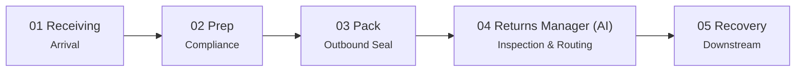
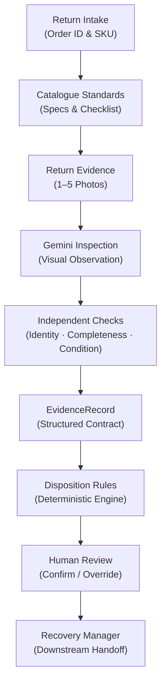

<p align="center">
  
</p>

<h1 align="center">ReturnOps AI</h1>

<p align="center">
  <strong>Evidence-First Returns Inspection & Disposition Agent</strong><br>
  <em>Inspect. Verify. Explain. Recover.</em>
</p>

<p align="center">
  <a href="https://returnops-ai.vercel.app"></a>
  <a href="https://github.com/Kanneboinashivakumar/cube26-rtn-0034-https-github.com-kanneboinashivakumar"></a>
  
</p>

<p align="center">
  <strong>Track:</strong> Returns Manager (RTN) &bull;
  <strong>Live App:</strong> <a href="https://returnops-ai.vercel.app">https://returnops-ai.vercel.app</a>
</p>

---

## 1. Project & Problem Understanding

ReturnOps AI is built for the **Returns Manager** stage (Step 4 of 5) in the Cube Buildathon operational returns lifecycle:



When a warehouse operator opens a returned parcel, they need to quickly answer four basic operational questions:
1. **Is this the item we sold?** (Identity check against seller catalogue SKU / ASIN)
2. **Is it complete?** (Completeness check against expected parts and accessories)
3. **What condition is it in?** (Condition check using the published condition scale)
4. **What should happen to it next?** (Disposition routing: restock, refurbish, liquidate, dispose, or pending review)

Doing this by hand in a busy warehouse often leads to inconsistent grading, missed missing parts, and damaged or incorrect goods being accidentally placed back on inventory shelves.

Our goal was to make this inspection workflow structured, fast, and backed by traceable visual evidence.

---

## 2. Solution Overview

ReturnOps AI provides a 2-screen web application for warehouse workstations:

- **Seller Catalogue Standards:** Loads expected SKU details, component checklists (required vs. optional), and reference images (`/api/catalogue`).
- **Return Evidence:** Ingests 1 to 5 photos of the returned item taken at the workstation.
- **Multimodal Visual Inspection:** Sends return photos and catalogue reference images to Google Gemini (`gemini-3.5-flash-lite`) in a single call.
- **Independent Checks:** Identity, Completeness, and Condition are evaluated as three separate checks so issues in one check do not bias the others.
- **Structured EvidenceRecord:** Produces a standardized, immutable JSON record with image references, check results, model metadata, latency, and a SHA-256 content hash.
- **Deterministic Dispositions:** Business logic in TypeScript (`src/lib/disposition-engine.ts`) selects the final disposition based on the check results, keeping business rules out of the prompt.
- **Operator Review:** The operator reviews the AI observations, side-by-side photos, and rule trace on Screen 2, then confirms or overrides the disposition (overrides require an explanation $\ge 10$ characters).
- **Audit & Downstream Handoff:** Stores the inspection in Supabase (with multi-tenant scoping) ready for consumption by downstream recovery workflows.

---

## 3. How It Works



### Typical Workflow:
1. Enter the Return ID, Order ID, and SKU / ASIN.
2. Fetch the seller catalogue standards.
3. Upload 1 to 5 return photos.
4. Run the multimodal inspection.
5. Review Identity, Completeness, and Condition independently.
6. Review the evidence findings and rule trace.
7. Confirm the result or override it with a reason.

---

## 4. Why This Architecture?

- **Gemini handles visual inspection only:** The model observes what is in the photos (e.g. visible logos, missing cables, scratches). It does not decide business dispositions.
- **Checks are decoupled:** A product can be damaged yet still be the correct SKU. Evaluating Identity, Completeness, and Condition independently avoids conflating separate questions.
- **Strict schema validation:** The application validates Gemini's output using Zod before applying any business logic.
- **Deterministic disposition rules:** Dispositions are assigned by explicit code in TypeScript with full rule traces, making decisions 100% predictable and debuggable.
- **Uncertainty is preserved:** If evidence is blurry or incomplete, the check returns `UNCERTAIN` and routes to human review rather than guessing.

---

## 5. Key Checks

1. **Identity:** Verifies whether the returned item matches the ordered SKU / ASIN using seller catalogue images, branding, and model labels.
2. **Completeness:** Checks each expected part from the catalogue checklist. If an item is in unopened manufacturer packaging with intact seals, completeness is verified via factory-sealed inference.
3. **Condition:** Grades physical wear using the Amazon 5-tier condition scale (`New`, `Used - Like New`, `Used - Very Good`, `Used - Good`, `Used - Acceptable`).

---

## 6. Decision Semantics

Following the official Buildathon contract, each check outputs one of three verdicts:

- **`PASS`:** The available evidence clearly supports that the condition is met.
- **`FAIL`:** The available evidence clearly shows that the condition is not met (e.g. wrong product returned, missing charging cable).
- **`UNCERTAIN`:** The available evidence is insufficient, blurry, obstructed, or unreadable to make a reliable determination.

> **Important:** `UNCERTAIN` is a valid, first-class outcome, **not** a low-confidence `PASS`. When evidence is unclear, ReturnOps AI does not guess—it preserves the evidence and routes the parcel to human review.

---

## 7. Disposition

The engine routes returns to one of five allowed dispositions:

| Disposition | Meaning | Rule Summary |
| :--- | :--- | :--- |
| **`restock`** | Return to inventory for resale | Identity = `PASS` $\land$ Completeness = `PASS` $\land$ Condition $\in \{\text{New}, \text{Used - Like New}\}$ |
| **`refurbish`** | Clean, test, or replace non-essential parts | Item has minor cosmetic wear (`Very Good` / `Good`) OR only optional accessories missing |
| **`liquidate`** | Route to secondary liquidation | Heavy cosmetic wear (`Used - Acceptable`) without structural damage |
| **`dispose`** | Scrap or recycle | Physical damage detected (`observed_state: "damaged"`) |
| **`pending_review`** | Manual operator inspection required | Mismatched identity, missing essential parts, or any check marked `UNCERTAIN` |

> **Application Policy Note:** The specific disposition rule mapping implemented in `src/lib/disposition-engine.ts` is **ReturnOps application policy** designed for our project evaluation, not an organizer-mandated universal warehouse standard.

---

## 8. Evidence & Auditability

Each inspection produces a structured `EvidenceRecord` containing:
- Record metadata (`record_id`, `schema_version`, `captured_at`, `operator_label`)
- Tenant context (`organization_id`, `client_id`)
- Subject information (`order_id`, `sku`, `asin`, `product_name`)
- Image references (labels `image_1` to `image_5`)
- Check results (Identity, Completeness, Condition verdicts, confidences, notes)
- Outcome (`disposition`, `policy_version`, full `rule_trace`)
- Overrides log (previous disposition, new disposition, operator, timestamp, and mandatory written reason $\ge 10$ characters)
- Status (`resolved`, `pending_review`, `failed`)
- Canonical SHA-256 `content_hash` computed over the record

The full TypeScript interface is defined in `src/lib/schemas.ts` and detailed in [ARCHITECTURE.md](ARCHITECTURE.md).

---

## 9. Tech Stack

| Layer | Component | Version | Purpose in ReturnOps |
| :--- | :--- | :---: | :--- |
| **Framework** | Next.js (App Router) | `16.3.7` | Full-stack application, API routes, Turbopack |
| **UI Library** | React & React DOM | `19.3.0` | Operator workstation interfaces |
| **Styling** | Tailwind CSS | `4.3.3` | Clean workstation layout & side-by-side evidence views |
| **Language** | TypeScript | `5.9.3` | Strict type safety and formal `EvidenceRecord` contract |
| **AI Model** | Google Gemini 3.5 Flash-Lite | `@google/generative-ai` `^0.24.1` | Single-call multimodal visual inspection |
| **Validation** | Zod | `^4.6.5` | Strict schema validation for inputs and observations |
| **Database** | Supabase (PostgreSQL) | `@supabase/supabase-js` `^2.117.2` | Multi-tenant inspection persistence with tenant/client scoping |
| **Failover Store** | Browser `sessionStorage` | Native | Local offline cache if database is unreachable |
| **Testing** | Jest & ts-jest | `^29.7.0` | Comprehensive unit and integration test suites (12 suites, 104 tests) |
| **Deployment** | Vercel Platform | Cloud | Live production deployment: [https://returnops-ai.vercel.app](https://returnops-ai.vercel.app) |
| **Security** | SHA-256 Digest | Native Node.js | Immutable cryptographic hash for EvidenceRecord audit |

---

## 10. Setup Instructions

### Prerequisites
- Node.js 20+ and npm 10+
- Google Gemini API key ([Google AI Studio](https://aistudio.google.com/))
- (Optional) Supabase project credentials

### 1. Clone & Install
```bash
git clone https://github.com/Kanneboinashivakumar/cube26-rtn-0034-https-github.com-kanneboinashivakumar.git
cd cube26-rtn-0034-https-github.com-kanneboinashivakumar
npm install
```

### 2. Configure Environment
Copy `.env.example` to `.env.local`:
```bash
cp .env.example .env.local
```

Set your local values in `.env.local`:
```env
# Google Gemini (Required)
GEMINI_API_KEY=your_gemini_api_key_here
GEMINI_MODEL=gemini-3.5-flash-lite

# Supabase (Optional - Falls back to sessionStorage if omitted)
NEXT_PUBLIC_SUPABASE_URL=https://your-project.supabase.co
NEXT_PUBLIC_SUPABASE_ANON_KEY=your_supabase_anon_key_here
SUPABASE_SERVICE_ROLE_KEY=your_supabase_service_role_key_here

# Multi-Tenant Defaults
DEFAULT_ORGANIZATION_ID=org_demo_alpha
DEFAULT_CLIENT_ID=client_demo_001
```

> **Note:** Real API keys belong in `.env.local` only and should never be committed. `.env.local` is ignored by Git.

### 3. Database Migration (Optional)
If you are using Supabase, apply the SQL schema in `supabase/migrations/` using the Supabase SQL editor. If credentials are not set, the app runs locally and saves to browser `sessionStorage`.

### 4. Development & Test Commands
```bash
# Start local dev server (port 3030)
npm run dev

# Run all 12 test suites (104 tests)
npm test

# Run unit tests only
npm run test:unit

# Run integration tests only
npm run test:integration

# Type check TypeScript code
npm run type-check

# Build for production
npm run build
```

---

## 11. Usage

1. **Intake (Screen 1 - `/`):**
   - Enter the Return ID, Order ID, and SKU or ASIN.
   - Click **Fetch Standards** to load catalogue details, reference images, and required/optional components.
   - Add 1 to 5 return photos showing product packaging, accessories, labels, and condition.
   - Click **Run Inspection**.
2. **Review (Screen 2 - `/results/[record_id]`):**
   - Review side-by-side visual evidence and check verdicts for Identity, Completeness, and Condition.
   - Check the Amazon condition grade and the rule trace explaining the disposition.
   - **Confirm:** If satisfied, click **Confirm Disposition** (sets status to `resolved`).
   - **Override:** If an operator needs to change the outcome, click **Override**, select a new disposition, and enter a required explanation ($\ge 10$ characters). The override is appended to the record's audit log.

---

## 12. Evaluation & Measured Results

The system was evaluated against 52 frozen held-out cases (`EVAL-001` through `EVAL-052`) across 9 product categories with dual-annotated human ground truth.

Two production versions were evaluated on the same frozen benchmark. The benchmark and ground truth were kept unchanged between runs.

| Metric | v1.0 | v1.1 |
| :--- | :---: | :---: |
| **Overall Disposition Accuracy** | **71.2%** (37/52) | **59.6%** (31/52) |
| **Identity Check Accuracy** | **84.6%** (44/52) | **53.8%** (28/52) |
| **Completeness Check Accuracy** | **80.8%** (42/52) | **48.1%** (25/52) |
| **Condition Verdict Accuracy** | **76.9%** (40/52) | **50.0%** (26/52) |
| **Critical Restock Safety Errors** | **0/52** | **0/52** |
| **Median Processing Latency** | **9.04s** | **5.54s** |
| **API Cost / Inspection** | **~$0.00028** | **~$0.00028** |
| **API Success Rate** | **100%** (52/52) | **100%** (52/52) |

### What changed in v1.1

v1.1 introduced stricter evidence handling for physical-merchandise verification, together with condition and completeness safeguards.

The same 52 frozen cases were rerun without changing their images or ground truth. A later fixture audit found that a substantial subset of the historical benchmark consists of synthetic SVG/text cards rather than photographs of physical merchandise.

On these cases, the stricter v1.1 evidence boundary returned `UNCERTAIN` instead of treating text-card content as physical-product evidence. This increased `pending_review` outcomes and reduced the benchmark's raw accuracy from 71.2% to 59.6%.

The important safety result remained unchanged: **0/52 critical restock safety errors in both versions.**

This benchmark therefore provides two useful measurements:
- v1.0 shows the original production behavior on the frozen benchmark.
- v1.1 shows the behavior after introducing stricter evidence handling.

### Benchmark Limitation

The 52 cases remain frozen and are reported as the historical Phase 8 benchmark. Because a later audit found synthetic SVG/text-card fixtures in a substantial subset of the cases, these results should not be interpreted as photographic inspection accuracy.

A separate photographic validation plan (`PHOTOGRAPHIC_VALIDATION_PLAN.md`) was prepared but was not executed for this submission.

For the detailed methodology and audits, see:

- `docs/EVALUATION.md`
- `docs/FAILURE_MODES.md`
- `evaluation/results/`

---

## 13. Assumptions & Limitations

- **Catalogue as ground truth:** Expected product identity, model numbers, and component lists provided by the seller catalogue are assumed to be accurate.
- **Image quality dependency:** The model's observations depend on photo focus, lighting, and angles.
- **Fail-open behavior:** When evidence is insufficient, blurry, or missing, the system outputs `UNCERTAIN` and routes to `pending_review`.
- **Condition scale:** Condition grading strictly follows the published Amazon 5-tier condition rubric.
- **Disposition rules:** Disposition mappings reflect ReturnOps application policy rather than an organizer-mandated universal standard.
- **Human oversight:** All automated decisions can be confirmed or overridden by a human operator.
- **Synthetic benchmark fixtures:** The frozen Phase 8 benchmark fixtures are synthetic visual cards rather than physical camera photos.
- **Photographic validation status:** Photographic validation was planned but not completed for this submission.

---

## 14. Architecture Reference

A detailed system specification, boundary analysis, sequence diagrams, and engineering decisions can be found in **[ARCHITECTURE.md](ARCHITECTURE.md)**.

---

## 15. Demo & Submission Links

| Item | Link / Status |
| :--- | :--- |
| **Live Web App** | [https://returnops-ai.vercel.app](https://returnops-ai.vercel.app) |
| **GitHub Repository** | [https://github.com/Kanneboinashivakumar/cube26-rtn-0034-https-github.com-kanneboinashivakumar](https://github.com/Kanneboinashivakumar/cube26-rtn-0034-https-github.com-kanneboinashivakumar) |
| **Round 2 Submission Workspace** | [`submissions/Kanneboinashivakumar/`](submissions/Kanneboinashivakumar/) |
| **Demo Video** | *[Placeholder — Record 3-minute walkthrough: Screen 1 intake, Screen 2 disposition, Screen 3 evidence audit]* |
| **LinkedIn Post** | *[Placeholder — Post tagging CodeQuesters & Sydon.AI]* |

---

**Cube Buildathon 2026 · Step 4 of 5: Returns Manager (`cube26_returns_manager_04`)**
