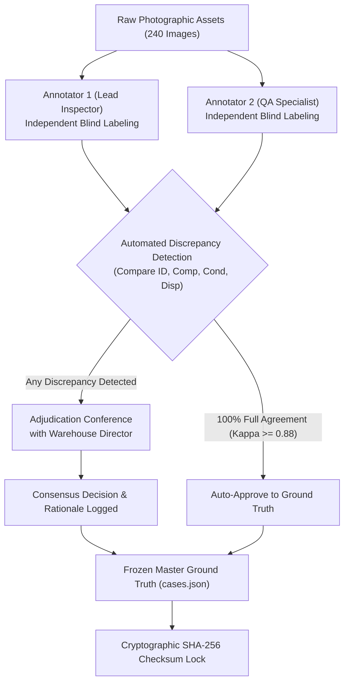

# Phase 9 Supplementary Photographic Validation Benchmark Plan

**Document Version:** 1.0  
**Phase Separation:** Phase 8 (Frozen Historical Benchmark, Audits, Documentation & Demo) vs Phase 9 (Separate Supplementary Photographic Validation & Future Production Certification)  
**Target Benchmark:** Phase 9 Supplementary Photographic Validation Set (`PHOTO-001` through `PHOTO-060`)  
**Status:** Architecture & Methodology Plan (Frozen Baseline Preservation Active; Plan Only; Unexecuted)  
**Historical Predecessor:** 52-Case Held-Out Evaluation Dataset (`EVAL-001` through `EVAL-052`)  
**Governing Policy:** Absolute Preservation of Historical Benchmarks; Plan Only; Zero Production/Fixture Modification.

---

## Executive Summary & Context

The Phase 8 v1.0 and v1.1 evaluation cycles established critical insights into the ReturnOps multimodal inspection pipeline:
1. **The Frozen 52-Case Benchmark (`EVAL-001` through `EVAL-052`):**
   - The forensic **Benchmark Fixture Validity Audit** confirmed that 100% of the 156 images in `evaluation/fixtures/held_out/images/` are synthetic vector placards rendered via Sharp/SVG markup.
   - In v1.0, Gemini interpreted these text tables and placards as descriptive visual proxies, achieving 71.2% disposition accuracy.
   - In v1.1, the engine enforced an essential enterprise anti-fraud safeguard (refusing to pass merchandise when only text placards or manifests are photographed), correctly triggering `UNCERTAIN` on 22 placard cases and moving accuracy to 59.6%.
   - The **Model-Integrity Audit** proved that both v1.0 and v1.1 used `gemini-3.5-flash-lite` exclusively with 0 rate limits, 0 retries, and 0 timeouts.
2. **The Need for a Supplementary Photographic Validation Set:**
   - Synthetic SVG placards evaluate whether an LLM can parse structured metadata; they **do not** evaluate whether computer vision can detect micro-scuffs on aluminum chassis, fraying on braided nylon cables, tamper-evident adhesive fractures on retail boxes, or counterfeit silkscreens.
   - To validate the ReturnOps vision engine against real-world warehouse logistics without altering, diluting, or deleting the frozen 52-case historical benchmark, we must establish a **separate, supplementary photographic validation benchmark** composed of authentic optical camera captures.

---

## Absolute Preservation Rule

The original 52-case held-out benchmark (`EVAL-001` through `EVAL-052`), its 156 image files, its ground-truth annotations, and its execution result files (`held_out_results_v1_0.json`, `held_out_results_v1_1.json`, `EVALUATION_REPORT_v1_1.md`) are **PERMANENTLY FROZEN**.

Under NO circumstances will this photographic validation initiative:
- Modify, rename, or delete `EVAL-001` through `EVAL-052`.
- Alter the ground-truth labels or rules of the original 52 cases.
- Overwrite existing v1.0 or v1.1 result artifacts.
- Merge the datasets into a single combined metric that obscures historical results.

The photographic validation set is a **supplementary benchmark** residing in its own dedicated namespace (`evaluation/photographic_validation/`).

---

## 1. Purpose of the Supplementary Photographic Validation Set

The primary purpose of the Supplementary Photographic Validation Set is to measure the true computer vision performance of the ReturnOps multimodal pipeline when processing camera-captured photographs of physical merchandise in a warehouse depot.

Specifically, this benchmark is engineered to validate:
1. **Multimodal Visual Grounding:** Confirming the model's ability to extract identity markers, detect missing components, and assess cosmetic and structural defects directly from optical pixels rather than written text summaries.
2. **Production Guardrail Discrimination:** Verifying that the anti-fraud guardrail (`SYSTEM_INSTRUCTION` Rule 3) correctly distinguishes genuine physical products from paper manifests and office printouts, while not falsely rejecting genuine photos of physical items.
3. **Factory-Sealed Package Inference:** Validating that genuine manufacturer shrinkwrap, tamper tape, and polybags are recognized optically, reliably routing sealed returns to `restock` under Rule 5a.
4. **4-Tier Condition Rubric Resolution:** Testing fine-grained visual differentiation between:
   - *Pristine/New* (unblemished, factory seals intact)
   - *Used - Like New* (opened box, pristine surfaces, no wear)
   - *Used - Very Good* (light micro-abrasions, handling smudges, faint swirl marks)
   - *Used - Good* (visible scratches, clear cosmetic wear, cord twists, no structural damage)
   - *Used - Acceptable* (heavy cosmetic abrasions, discoloration, worn grips)
5. **Physical Damage & Safety Enforcement:** Testing detection of structural failures (cracked displays, bent connectors, exposed conductors, punctures, shattered enclosures) and hazardous leaks, ensuring 100% deterministic routing to `dispose` under Rule 5c or Rule 6.
6. **Robust Fail-Open Behavior:** Proving that unreadable labels, blurry optics, extreme glare, and occluded items consistently produce `UNCERTAIN` and route safely to `pending_review` (Rule 7), maintaining a 0.0% critical restock safety error rate.

---

## 2. Directory Structure & File Conventions

The supplementary dataset will be housed under `evaluation/photographic_validation/` with strict separation between test fixtures, image assets, ground-truth annotations, runner scripts, and results.

```
evaluation/photographic_validation/
├── fixtures/
│   ├── cases.json                     # Complete master specification of all photographic returns
│   ├── splits/
│   │   ├── dev_manifest.json          # 20 development/tuning cases (PHOTO-DEV-001 to 020)
│   │   └── held_out_manifest.json     # 40 held-out validation cases (PHOTO-VAL-001 to 040)
│   └── reference_catalog/
│       ├── expected_skus.json         # Master catalog metadata (names, categories, MSRP, components)
│       └── reference_images/          # Official OEM catalog reference photos for SKU matching
├── images/
│   ├── dev/                           # 80 images for development cases (4 photos per case)
│   │   ├── PHOTO-DEV-001_01.jpg
│   │   ├── PHOTO-DEV-001_02.jpg
│   │   ├── PHOTO-DEV-001_03.jpg
│   │   └── PHOTO-DEV-001_04.jpg
│   └── held_out/                      # 160 images for held-out validation cases (4 photos per case)
│       ├── PHOTO-VAL-001_01.jpg
│       ├── PHOTO-VAL-001_02.jpg
│       ├── PHOTO-VAL-001_03.jpg
│       └── PHOTO-VAL-001_04.jpg
├── annotations/
│   ├── annotator_1_raw.json           # Primary warehouse inspector blind labels
│   ├── annotator_2_raw.json           # Secondary QA specialist blind labels
│   ├── consensus_resolution_log.json  # Discrepancy mediation records & tie-breaker signoffs
│   └── ground_truth_master.json       # Frozen, cryptographically hashed consensus labels
├── scripts/
│   ├── run_photo_dev_eval.js          # Runner for development set
│   └── run_photo_held_out_eval.js     # Runner for frozen held-out validation set
└── results/
    ├── dev_results.json               # Development run results
    ├── held_out_results.json          # Official held-out photographic results
    ├── PHOTO_EVALUATION_REPORT.md     # Comprehensive evaluation report with confusion matrices
    └── DUAL_BENCHMARK_SCOREBOARD.md   # Side-by-side comparison with frozen 52-case baseline
```

### File Naming Conventions:
- **Case IDs:** `PHOTO-DEV-001` through `PHOTO-DEV-020` for development cases; `PHOTO-VAL-001` through `PHOTO-VAL-040` for held-out validation cases.
- **Image Filenames:** `{Case_ID}_{Angle_Number}.jpg` (e.g., `PHOTO-VAL-014_03.jpg`).
- **Angle Codes:**
  - `_01`: Staging & Packaging Overview (wide angle showing packaging + main merchandise)
  - `_02`: Component & Accessory Flat-Lay (knolling layout of all items on inspection grid)
  - `_03`: Macro Identification Close-Up (high-res focus on model, serial, barcode, or seal)
  - `_04`: Defect, Wear, or Detail Macro (close-up on physical damage, scuffs, wear, or seal integrity)

---

## 3. Target Size & Case Volume

The dataset will comprise **60 distinct return cases** totaling **240 standardized photographic images**:

| Dataset Partition | Case Count | Images per Case | Total Photographic Assets | Primary Purpose |
| :--- | :---: | :---: | :---: | :--- |
| **Development Set (`dev`)** | 20 cases | 4 images | 80 photos | Engineering prompt refinement, operator guidance calibration, and pre-run smoke testing |
| **Held-Out Validation Set (`held_out`)** | 40 cases | 4 images | 160 photos | Formal, unobserved model benchmark for production certification |
| **Total Supplementary Benchmark** | **60 cases** | **4 images** | **240 photos** | Comprehensive multimodal vision validation |

### Validation Sample Rationale:
- A 40-case held-out partition provides a compact, controlled validation set for estimating benchmark performance and detecting major failure modes. Results should be reported with appropriate uncertainty intervals and should not be interpreted as population-level production performance estimates.
- Testing across 4 distinct angles per return (160 images total) evaluates multi-perspective spatial reasoning, cross-image occlusion resolution, and macro feature extraction within this controlled sample.
- Preserves a clean 1:2 split ratio (33.3% dev, 66.7% held-out), preventing overfitting while ensuring adequate development diagnostic capability.

---

## 4. Product Category Distribution

To ensure comprehensive domain generalization, the 60 cases span **6 core retail and e-commerce categories**, reflecting high-volume return operations:

| Category Code | Product Category | Dev Cases | Held-Out Cases | Total Cases | Target SKU Examples |
| :--- | :--- | :---: | :---: | :---: | :--- |
| **CAT-ELEC** | Consumer Electronics & Audio | 4 | 8 | 12 | Noise-cancelling headphones, wireless earbuds, Bluetooth speakers, USB-C cables, smartwatches |
| **CAT-COMP** | Computing & Office Hardware | 4 | 8 | 12 | 15" laptops, mechanical keyboards, USB-C docking hubs, ergonomic mice, LED desk lamps |
| **CAT-BEAU** | Beauty, Cosmetics & Personal Care | 3 | 6 | 9 | Facial serums (glass dropper), electric shavers, moisturizing creams (tamper-sealed), sonic toothbrushes |
| **CAT-HOME** | Home, Kitchen & Drinkware | 3 | 6 | 9 | Insulated stainless water bottles, single-serve blenders, ceramic mugs, chef knives, microfiber towels |
| **CAT-APPA** | Apparel, Footwear & Accessories | 3 | 6 | 9 | Running sneakers, waterproof jackets, leather belts, sunglasses, knitted scarves |
| **CAT-PETS** | Pet Supplies & Sports Equipment | 3 | 6 | 9 | Heavy-duty dog leashes, pet grooming clippers, yoga mats, resistance bands, protein powder tubs |
| **TOTAL** | **6 Categories** | **20** | **40** | **60** | **Representative cross-retail coverage** |

---

## 5. Return Scenario Distributions

The 60 cases are deliberately balanced across operational scenarios to test every branch of the ReturnOps disposition engine.

> [!NOTE] Policy Specification
> The expected dispositions defined in the scenario trees and matrix below represent **ReturnOps application policy / evaluation ground truth** based on the project's documented disposition rule engine (`src/lib/disposition-engine.ts`). They are project-specific evaluation ground-truth baselines and must NOT be interpreted as universal warehouse rules, organizer-authoritative rules, industry-wide rules, or Amazon-authoritative rules.

```
Total Photographic Cases (60) [ReturnOps Application Policy / Evaluation Ground Truth]
├── Pristine & Factory Sealed (12 cases) ──> Rule 5a (restock)
├── Opened - Like New (10 cases) ──────────> Rule 5a (restock)
├── Opened - Normal Handling Wear (10 cases)> Rule 5b (refurbish)
├── Missing Non-Essential Acc. (6 cases) ──> Rule 4 (refurbish)
├── Missing Essential Acc. (6 cases) ─────> Rule 3 (pending_review)
├── Physical Damage / Broken (8 cases) ────> Rule 5c (dispose)
├── Wrong Product / Fraud / Swap (4 cases) > Rule 1 (pending_review / fraud_review)
└── Ambiguous / Blurry / Occluded (4 cases) > Rule 7 (pending_review - UNCERTAIN)
```

### Detailed Scenario Matrix (ReturnOps Application Policy / Evaluation Ground Truth):

| Scenario Group | Dev Cases | Held-Out Cases | Total Cases | Expected Identity | Expected Completeness | Expected Condition Grade | Expected Disposition (ReturnOps Application Policy / Evaluation Ground Truth) |
| :--- | :---: | :---: | :---: | :---: | :---: | :---: | :---: |
| **1. Factory-Sealed (Intact Seals)** | 4 | 8 | 12 | PASS | PASS (inferred) | New | `restock` |
| **2. Pristine Open-Box (Like New)** | 3 | 7 | 10 | PASS | PASS | Used - Like New | `restock` |
| **3. Cosmetic Handling Wear** | 3 | 7 | 10 | PASS | PASS | Used - Very Good / Good | `refurbish` |
| **4. Missing Non-Essential Accessory** | 2 | 4 | 6 | PASS | FAIL | Used - Like New / Good | `refurbish` |
| **5. Missing Essential Component** | 2 | 4 | 6 | PASS | FAIL | Any | `pending_review` |
| **6. Severe Physical Damage** | 3 | 5 | 8 | PASS | PASS / FAIL | Used - Acceptable | `dispose` |
| **7. Wrong Product / Fraudulent Swap** | 1 | 3 | 4 | FAIL | Any | Any | `pending_review` |
| **8. Degraded / Ambiguous Evidence** | 2 | 2 | 4 | UNCERTAIN | UNCERTAIN | UNCERTAIN | `pending_review` |
| **TOTAL** | **20** | **40** | **60** | — | — | — | — |

---

## 6. Specific Operational Scenario Definitions

### 6.1 Identity Scenarios (Section 5 Requirement)
- **Authentic Match (PASS):** Visual branding, silkscreened logos, model stamps, and SKU labels match reference specs precisely.
- **Model Generation Mismatch (FAIL):** Return contains a previous-generation device (e.g. WH-1000XM4 returned in WH-1000XM5 packaging, or 65W charger returned instead of 100W charger).
- **Colorway/Variant Mismatch (FAIL):** Return contains Midnight Blue variant when Space Gray was invoiced.
- **Counterfeit/Knockoff (FAIL):** Generic unbranded clone lacking OEM regulatory FCC/CE markings, featuring incorrect fonts and substandard chassis seams.
- **Defaced/Unreadable Identifiers (UNCERTAIN):** Serial label peeled off, barcode partially torn, or model typography abraded beyond OCR recognition.

### 6.2 Completeness Scenarios (Section 6 Requirement)
- **100% Complete (PASS):** Base product plus all bundled items (cables, adapters, cases, manuals, extra ear tips, mounting hardware) clearly visible.
- **Missing Minor Accessory (FAIL):** Base product and power cable present, but quick-start guide, reference poster, or warranty card missing. Triggers Rule 4 (`refurbish`).
- **Missing Essential Accessory (FAIL):** Base laptop present but AC power adapter missing; or wireless earbuds present but charging case missing. Triggers Rule 3 (`pending_review`).
- **Factory-Sealed Package (PASS via Inference):** Manufacturer cellophane, tamper tape, or blister seal intact. Completeness automatically inferred as PASS without requiring box destruction.
- **Concealed/Bundled Accessories (UNCERTAIN):** Accessories packed inside an unphotographed opaque pouch, triggering operator guidance for flat-lay knolling.

### 6.3 Condition Scenarios (Section 7 Requirement)
- **New (Pristine):** Factory-sealed or completely unhandled; zero contact marks, original protective peelable films intact.
- **Used - Like New:** Box opened to inspect contents; zero surface scratches, zero fingerprints, pristine charging pins, cables neatly factory-folded.
- **Used - Very Good:** Minor cosmetic evidence of handling: faint surface fingerprints, faint micro-swirls visible under specular light, no deep scratches or dents.
- **Used - Good:** Clear cosmetic wear: noticeable surface scuffs, light scratches on plastic casing, uncoiled cords with minor kinks, fully functional enclosure.
- **Used - Acceptable:** Substantial cosmetic wear: heavy scuff marks, paint chipping on bottle rims, faded fabrics, adhesive residue, heavy sole wear on shoes, no structural breakage.

### 6.4 Damage Scenarios (Section 8 Requirement)
- **Display Damage:** Shattered LCD/OLED glass, spiderweb cracks, panel puncture.
- **Connector/Wiring Damage:** Severed USB jacket, exposed copper braiding, bent Type-C pins, broken AC prongs.
- **Enclosure Failure:** Snapped headphone headband, cracked hinge, shattered lamp base, crushed aluminum casing.
- **Liquid/Chemical Ingress & Leakage:** Broken glass dropper, spilled cosmetic emulsion, empty protein container with torn seal.
- **Enforcement Rule:** All damage scenarios must assign `observed_state: "damaged"` and `grade: "Used - Acceptable"`, strictly triggering deterministic routing to `dispose` under Rule 5c.

### 6.5 Ambiguous / UNCERTAIN Scenarios (Section 9 Requirement)
- **Defocus Blur:** Lens out of focus, rendering typography and surface texture unresolvable ($r > 12\text{px}$ blur radius).
- **Severe Glare:** Specular reflection from overhead fluorescent lighting obscuring 70%+ of the display or barcode label.
- **Severe Underexposure:** Photo taken in low warehouse light (< 15 lux), obscuring component details.
- **Packaging Occlusion:** Item photographed half-inside brown corrugated shipping carton with brown kraft paper covering the main chassis.
- **Mandatory Outcome:** 100% abstention (`UNCERTAIN`) on affected checks, routing safely to `pending_review` (Rule 7). 100% UNCERTAIN on the four predefined degraded/ambiguous test cases is a targeted safety test, not evidence of general robustness across all degraded photographic conditions.

### 6.6 Wrong-Product Scenarios (Section 10 Requirement)
- **Total Cross-Category Swap:** Return box contains a red bath towel instead of an LED desk lamp.
- **Disposable Item Substitution:** Disposable 500ml plastic water bottle returned inside premium 750ml insulated flask packaging.
- **Fraudulent Weight/Brick-in-Box:** Brown shipping box packed with bubble wrap and wooden block; genuine merchandise completely absent.
- **Mandatory Outcome:** Identity = `FAIL`, routing immediately to `pending_review` with `fraud_flag: true`.

### 6.7 Sealed-Package Scenarios (Section 11 Requirement)
- **Shrinkwrap/Cellophane:** Transparent OEM film with tight heat-sealed corner folds.
- **Tamper-Evident Tape/Sticker:** Unbroken circular wafer seal or holographic security label spanning the box lid seam.
- **Ultrasonic Blister Pack:** High-frequency plastic weld around perimeter showing zero puncture or slit marks.
- **Ruptured Seal Test:** Factory sticker cut through with utility knife or cellophane torn open; must be recognized as *Opened*, not *Sealed*.

---

## 7. Mandatory Multi-Angle Photography Protocol

To replicate professional warehouse inspection stations (such as Cube26 / ReturnOps RTN workstations), each return case must provide exactly **4 standardized camera photographs**:

```
+-----------------------------------------------------------------------------------+
|                            4-ANGLE OPERATOR PROTOCOL                              |
+-------------------------+-------------------------+-------------------------------+
| Photo 1: Overall View   | Photo 2: Accessory Flat | Photo 3: Macro ID / Barcode   |
| (Staging & Packaging)   | (Knolling Layout)       | (Serial, UPC, Model, Seal)    |
| - Product + Retail Box  | - All components laid   | - Razor-sharp focus on        |
| - Matte gray grid mat   |   flat, zero overlap    |   product label & barcodes    |
| - Wide perspective      | - Cables unbundled      | - High contrast, no glare     |
+-------------------------+-------------------------+-------------------------------+
| Photo 4: Defect / Wear / Detail Macro                                             |
| - Close-up on damage, wear area, connector pins, or seal intactness               |
| - 1:1 macro crop showing surface texture and micro-abrasions                     |
+-----------------------------------------------------------------------------------+
```

### Technical Capture Specifications:
1. **Camera Sensor:** Minimum 12.0 Megapixel optical sensor (e.g. industrial inspection camera or modern smartphone sensor, $\ge 3000 \times 2000$ resolution).
2. **Lighting Setup:** Dual-head 5000K daylight-balanced LED lighting with soft diffusers (producing $> 500\text{ lux}$ incident illumination, minimizing harsh specular reflections).
3. **Inspection Surface:** Non-reflective matte gray inspection mat featuring a printed 1-inch reference measurement grid.
4. **File Format & Compression:** Standard sRGB JPEG, 85-90% quality compression, average file size 1.5MB – 3.5MB per image.
5. **EXIF Metadata:** Valid timestamp, focal length, exposure time, and orientation tags; zero synthetic metadata tags.

---

## 8. Human Labeling & Ground-Truth Annotation Protocol

Ground-truth annotations must adhere to a strict double-blind consensus process to guarantee institutional-grade data integrity.



### 8.1 The Double-Blind Review Procedure
1. **Annotator 1 (Lead Warehouse Inspector):** Inspects the 4 photographs using a standardized web tool without access to model predictions, previous notes, or secondary opinions.
2. **Annotator 2 (Quality Assurance Lead):** Independently inspects the exact same 4 photographs under the same conditions.
3. **Discrepancy Trigger:** If Annotator 1 and Annotator 2 disagree on any of:
   - Identity Verdict (`PASS`, `FAIL`, `UNCERTAIN`)
   - Completeness Verdict (`PASS`, `FAIL`, `UNCERTAIN`)
   - Condition Grade (`New`, `Used - Like New`, `Used - Very Good`, `Used - Good`, `Used - Acceptable`)
   - Observed State (`unopened`, `like_new`, `signs_of_use`, `damaged`, `inconclusive`)
   - Final Disposition (`restock`, `refurbish`, `liquidate`, `dispose`, `pending_review`)
4. **Adjudication Conference:** Disagreed cases are reviewed in person with the Warehouse Operations Director acting as the final tie-breaker. The physical rationale is documented in `annotations/consensus_resolution_log.json`.
5. **Consensus Requirement:** Inter-annotator agreement prior to adjudication must achieve Cohen's Kappa $\kappa \ge 0.88$ across all 60 cases.

---

## 9. Train / Development vs Held-Out Separation & Anti-Leakage Protocol

To ensure evaluation rigor and eliminate data contamination, strict data isolation practices will be enforced:

### 9.1 Partition Allocation
- **Development Partition (`PHOTO-DEV-001` through `PHOTO-DEV-020`):**
  - Publicly visible to developers and engineers.
  - Used for calibrating prompt guidelines, debugging JSON schemas, tuning operator capture tips, and verifying unit tests.
- **Held-Out Validation Partition (`PHOTO-VAL-001` through `PHOTO-VAL-040`):**
  - Strictly isolated and unobserved.
  - Never used in few-shot prompt examples.
  - Never inspected during iterative prompt engineering.
  - Evaluated only during formal certification runs.

### 9.2 Anti-Leakage Controls
1. **Directory Isolation:** Held-out fixtures reside in `fixtures/splits/held_out_manifest.json` and images in `images/held_out/`.
2. **No Dynamic RAG / Few-Shot Ingestion:** The production API endpoint (`/api/inspect`) does not ingest evaluation directories into prompt contexts.
3. **Checksum Verification:** The held-out manifest and images will have SHA-256 hashes generated upon consensus lock. CI scripts will verify that held-out files have not been modified before any evaluation execution.
4. **Zero-Iteration Policy:** The held-out dataset may only be evaluated once per formal release candidate (e.g. Phase 9 candidate). Prompt modifications based on held-out error analysis require creating a new versioned benchmark.

---

## 10. Anti-Cherry-Picking Rules

To ensure academic and enterprise credibility, the benchmark incorporates strict anti-cherry-picking rules:
1. **Preregistration of Case Manifest:** The master `cases.json` specifying all 60 cases, scenarios, and SKUs must be committed and hashed in git **before** the evaluation script is executed.
2. **Zero-Exclusion Execution:** The runner script must execute all 40 held-out cases sequentially in numerical order. It is strictly forbidden to discard outliers, remove unexpected failures, or re-run individual failing cases.
3. **Single Continuous Run:** All 40 held-out cases must be executed in a single batch against `http://localhost:3030/api/inspect` with automated timestamping.
4. **Full Error Disclosure:** All disagreements, false positives, false negatives, and abstentions must be published in full $3 \times 3$ confusion matrices in the final report.

---

## 11. Evaluation Metrics & Mathematical Formulas

The photographic evaluation will measure 11 quantitative performance indicators across the multimodal pipeline:

### 11.1 Check Accuracy Metrics
1. **Identity Accuracy ($Acc_{id}$):**
   $$\text{Accuracy}_{id} = \frac{\sum_{i=1}^N \mathbb{I}(\text{pred\_id}_i = \text{gt\_id}_i)}{N}$$
   Evaluated over 3 classes: `PASS`, `FAIL`, `UNCERTAIN`.
2. **Completeness Accuracy ($Acc_{comp}$):**
   $$\text{Accuracy}_{comp} = \frac{\sum_{i=1}^N \mathbb{I}(\text{pred\_comp}_i = \text{gt\_comp}_i)}{N}$$
   Evaluated over 3 classes: `PASS`, `FAIL`, `UNCERTAIN`.
3. **Condition Verdict Accuracy ($Acc_{cond\_verdict}$):**
   $$\text{Accuracy}_{cond} = \frac{\sum_{i=1}^N \mathbb{I}(\text{pred\_cond\_verdict}_i = \text{gt\_cond\_verdict}_i)}{N}$$
4. **Exact Condition Grade Accuracy ($Acc_{grade}$):**
   $$\text{Accuracy}_{grade} = \frac{\sum_{i=1}^N \mathbb{I}(\text{pred\_grade}_i = \text{gt\_grade}_i)}{N}$$
   Evaluated over 5 discrete tiers: `New`, `Used - Like New`, `Used - Very Good`, `Used - Good`, `Used - Acceptable`.
5. **Final Disposition Accuracy ($Acc_{disp}$):**
   $$\text{Accuracy}_{disp} = \frac{\sum_{i=1}^N \mathbb{I}(\text{pred\_disp}_i = \text{gt\_disp}_i)}{N}$$
   Evaluated across all 5 disposition outcomes: `restock`, `refurbish`, `liquidate`, `dispose`, `pending_review`.

### 11.2 Safety & Error Rate Metrics
6. **UNCERTAIN (Abstention) Rate ($R_{unc}$):**
   $$R_{unc} = \frac{\sum_{i=1}^N \mathbb{I}(\text{pred\_disp}_i = \text{"pending\_review"} \land \text{gt\_disp}_i \neq \text{"pending\_review"})}{N}$$
   Tracks rate of safe fail-open human escalation.
7. **False-Positive Identity Rate ($FPR_{id}$):**
   $$FPR_{id} = \frac{\text{Count}(\text{pred\_id} = \text{"PASS"} \land \text{gt\_id} \in \{\text{"FAIL"}, \text{"UNCERTAIN"}\})}{\text{Count}(\text{gt\_id} \in \{\text{"FAIL"}, \text{"UNCERTAIN"}\})}$$
   Measures risk of accepting counterfeit, incorrect, or unidentifiable items.
8. **False-Positive Completeness Rate ($FPR_{comp}$):**
   $$FPR_{comp} = \frac{\text{Count}(\text{pred\_comp} = \text{"PASS"} \land \text{gt\_comp} \in \{\text{"FAIL"}, \text{"UNCERTAIN"}\})}{\text{Count}(\text{gt\_comp} \in \{\text{"FAIL"}, \text{"UNCERTAIN"}\})}$$
   Measures risk of approving returns missing critical components.
9. **Critical Restock Safety Error Rate ($E_{safety}$):**
   $$E_{safety} = \frac{\text{Count}(\text{pred\_disp} = \text{"restock"} \land \text{gt\_disp} \in \{\text{"dispose"}, \text{"liquidate"}, \text{"pending\_review"} \text{ [fraud/missing]}\})}{N}$$
   **Strict Operational Constraint:** Must be exactly **0.0%**. Zero tolerance for hazardous, damaged, counterfeit, or missing-parts returns being routed to customer restock.

### 11.3 Performance & Cost Metrics
10. **Inspection Latency:**
    - p50 (median), p90, and p99 turnaround time per inspection in seconds.
11. **API Operational Cost:**
    - Average input tokens, output tokens, and USD cost per inspection using `gemini-3.5-flash-lite`.

---

## 12. Evaluation Runner Script Requirements

The runner script (`scripts/run-photo-eval.js`) must implement the following architectural features:
1. **Production Endpoint Interface:** Make real HTTP POST multipart requests directly to `http://localhost:3030/api/inspect`, mimicking the production Next.js web application.
2. **Multi-Image Payload Packaging:** Load all 4 JPEG files for each return, pack them into the `images` form field, and attach the corresponding SKU and expected components.
3. **Controlled Rate & Concurrency:** Execute requests sequentially with a configurable 1500ms pacing delay between items to prevent API rate limiting.
4. **Deterministic Disposition Evaluation:** Apply the official `evaluateDisposition()` engine to the vision output to mirror production routing.
5. **Automated Matrix & Kappa Generation:** Automatically compute $3 \times 3$ confusion matrices for Identity, Completeness, and Condition, a $5 \times 5$ matrix for Condition Grade, a $5 \times 5$ matrix for Disposition, and multi-class Cohen's Kappa.
6. **Artifact Output Generation:**
   - Save full JSON results to `evaluation/photographic_validation/results/held_out_results.json`.
   - Generate markdown summary to `evaluation/photographic_validation/results/PHOTO_EVALUATION_REPORT.md`.

---

## 13. Reporting Format & Dual-Benchmark Coexistence Strategy

Results will be presented using a **Dual-Benchmark Architecture**. The photographic evaluation results will be published side-by-side with the frozen 52-case historical benchmark, clearly delineating the modality and purpose of each:

```
========================================================================================
                          RETURNOPS COMPREHENSIVE SCOREBOARD
========================================================================================
Benchmark Track           Modality               Cases   Disposition Acc.  Safety Errors
----------------------------------------------------------------------------------------
Phase 8 v1.0 Historical   Synthetic SVG Placard    52         71.2%             0.0%
Phase 8 v1.1 Baseline     Synthetic SVG Placard    52         59.6%             0.0%
Phase 9 Supplementary     Authentic Photo Camera   40      [Target: >80%]       0.0%
========================================================================================
```

### Reporting Sections:
1. **Modality Disclosure:** Explicitly state whether the test was performed on synthetic placards or authentic optical camera photographs.
2. **Per-Check Breakdown:** Present separate precision, recall, and F1 scores for Identity, Completeness, Condition Verdict, Condition Grade, and Disposition.
3. **Guardrail Integrity Table:** Document the exact behavior of Rule 3 (photo verification) and Rule 5a (sealed package inference) across photographic cases.
4. **Side-by-Side Confusion Matrices:** Compare the confusion matrices of the photographic benchmark against the v1.0 and v1.1 historical baselines.

---

## 14. Acceptance Criteria for Production Certification (ReturnOps Project-Defined Internal Acceptance Targets)

The criteria below represent **ReturnOps project-defined internal acceptance targets** for assessing pipeline production readiness in future Phase 9 validation. They are internal project engineering targets and must NOT be interpreted as organizer requirements, official CUBE Buildathon thresholds, industry certification standards, or Amazon policy thresholds.

| Metric / Dimension | ReturnOps Project-Defined Internal Acceptance Target | Criticality |
| :--- | :---: | :---: |
| **Critical Restock Safety Errors** | **0.0% (Zero tolerance)** | **BLOCKER** |
| **Disposition Accuracy** | $\ge 80.0\%$ (Target: $\ge 85.0\%$) | **HIGH** |
| **Identity Check Accuracy** | $\ge 85.0\%$ | **HIGH** |
| **Completeness Check Accuracy** | $\ge 85.0\%$ | **HIGH** |
| **Condition Verdict Accuracy** | $\ge 85.0\%$ | **HIGH** |
| **Exact Condition Grade Accuracy** | $\ge 75.0\%$ | **MEDIUM** |
| **False-Positive Identity Rate** | $\le 5.0\%$ | **HIGH** |
| **False-Positive Completeness Rate** | $\le 5.0\%$ | **HIGH** |
| **Abstention (UNCERTAIN) Accuracy on Degraded Images** | $100.0\%$ (4/4 cases) | **HIGH** |
| **p50 Latency** | $\le 4.0\text{ seconds}$ | **MEDIUM** |
| **API Cost per Inspection** | $\le \$0.005$ | **MEDIUM** |

> [!NOTE] Degraded Image Target Scope
> 100% UNCERTAIN on the four predefined degraded/ambiguous test cases is a targeted safety test, not evidence of general robustness across all degraded photographic conditions.

---

## 15. Phase 9 Execution Timeline & Milestone Gates

The ReturnOps project maintains a strict phase separation:
- **Phase 8 (Completed & Frozen):** Historical benchmark evaluation, audits, documentation, demo verification, and submission.
- **Phase 9 (Future Validation Work):** Separate supplementary photographic validation and future production-validation work.

The photographic validation work is strictly designated as Phase 9 and is NOT part of the completed Phase 8 evaluation. Phase 9 is planned here as a methodology specification but is NOT executed.

```
Phase 9.1: Fixture Architecture & Catalog Definition ──────────> GATE 1 (Plan Approved)
Phase 9.2: 240-Image Optical Acquisition & Staging ────────────> GATE 2 (Pending Phase 9 Approval)
Phase 9.3: Double-Blind Human Annotation & Consensus Lock ─────> GATE 3 (Pending Phase 9 Approval)
Phase 9.4: Dev Set Verification & Evaluation Smoke Test ───────> GATE 4 (Pending Phase 9 Approval)
Phase 9.5: Formal Held-Out Photographic Evaluation Run ────────> GATE 5 (Pending Phase 9 Approval)
Phase 9.6: Production Certification & Hand-off ────────────────> GATE 6 (Pending Phase 9 Approval)
```

### Milestone Descriptions:
- **Gate 1 (Catalog Definition - Phase 9.1):** Finalize 60 SKU definitions, accessories, and scenarios in `cases.json`.
- **Gate 2 (Optical Acquisition - Phase 9.2):** Complete physical photography of 240 multi-angle images adhering to the 4-angle protocol.
- **Gate 3 (Consensus Lock - Phase 9.3):** Execute double-blind labeling with Annotators 1 & 2; adjudicate discrepancies; compute Cohen's Kappa ($\ge 0.88$); freeze and hash `ground_truth_master.json`.
- **Gate 4 (Dev Smoke Test - Phase 9.4):** Run `run_photo_dev_eval.js` across 20 dev cases. Verify schemas, parsing, latency, and guardrail responses.
- **Gate 5 (Held-Out Evaluation - Phase 9.5):** Execute `run_photo_held_out_eval.js` across 40 frozen held-out cases. Generate reports and publish the dual-benchmark scoreboard.
- **Gate 6 (Production Certification - Phase 9.6):** Final production certification report comparing photographic results alongside the historical Phase 8 benchmark.

---

## 16. Synthetic-Placard Benchmark Deprecation Timeline

The historical 52-case synthetic benchmark will **never be deleted**, but its role transitions across phases:
- **Phase 8 Role (Completed):** Active regression test fixture documenting the prompt guardrail evolution between v1.0 and v1.1.
- **Phase 9 Role (Supplementary Coexistence):** Historical baseline benchmark reported alongside the supplementary photographic validation set in the dual scoreboard.
- **Post-Phase 9 Long-Term Role:** Archived regression suite used exclusively for checking synthetic document/manifest parsing and anti-scraping guardrails. The photographic validation benchmark will become the primary benchmark for all production vision releases.

---

## 17. Risk Management & Mitigation Strategies

| Risk Description | Probability | Impact | Mitigation Strategy |
| :--- | :---: | :---: | :--- |
| **Camera Glare Masking Crucial Barcodes** | Medium | High | Operator capture protocol specifies non-reflective matte backgrounds and angled diffuse lighting; macro shot requires 45-degree angle to avoid direct specular reflection. |
| **Labeling Ambiguity on Cosmetic Wear** | High | Medium | Standardize observable physical criteria for each grade tier (e.g. scratch depth, finger smudge cleanability, millimeter abrasion counts) in the annotation UI. |
| **API Rate Limiting During 40-Case Run** | Low | High | Enforce 1500ms pacing delays between test cases; verify quota limits in Google Cloud Console prior to batch launch. |
| **Held-Out Data Leakage into Development** | Low | High | Strict directory separation; cryptographic hash verification in CI/CD pipeline before running evaluations. |
| **Model Version Drift** | Low | High | Lock provider configuration strictly to `gemini-3.5-flash-lite`; log response headers and model fingerprint with every inspection. |

---

## 18. Appendix: Photographic Test Case JSON Schema

Below is the complete TypeScript interface and JSON schema definition for the supplementary photographic test cases:

```typescript
export interface ExpectedComponent {
  name: string;
  essential: boolean;
}

export interface PhotographicCase {
  case_id: string;                      // e.g. "PHOTO-VAL-001"
  partition: "dev" | "held_out";
  sku: string;                          // e.g. "WH-1001"
  product_name: string;
  category: "Consumer Electronics" | "Computers" | "Beauty & Personal Care" | "Home & Kitchen" | "Apparel" | "Sports & Outdoors";
  expected_components: ExpectedComponent[];
  scenario_description: string;
  operational_category: 
    | "pristine_sealed"
    | "opened_like_new"
    | "handling_wear"
    | "missing_non_essential"
    | "missing_essential"
    | "physical_damage"
    | "wrong_product"
    | "degraded_evidence";
  image_paths: [
    string,                             // Angle 1: Overall Staging & Packaging
    string,                             // Angle 2: Accessory Flat-Lay (Knolling)
    string,                             // Angle 3: Macro Identification / Barcode
    string                              // Angle 4: Defect / Wear / Detail Close-Up
  ];
  ground_truth: {
    identity: {
      verdict: "PASS" | "FAIL" | "UNCERTAIN";
      confidence_min: number;
      matched_sku: string | null;
    };
    completeness: {
      verdict: "PASS" | "FAIL" | "UNCERTAIN";
      confidence_min: number;
      missing_essential_count: number;
      missing_non_essential_count: number;
      components_present: Record<string, boolean>;
    };
    condition: {
      verdict: "PASS" | "FAIL" | "UNCERTAIN";
      grade: "New" | "Used - Like New" | "Used - Very Good" | "Used - Good" | "Used - Acceptable";
      observed_state: "unopened" | "like_new" | "signs_of_use" | "damaged" | "inconclusive";
      damage_flag: boolean;
    };
    disposition: "restock" | "refurbish" | "liquidate" | "dispose" | "pending_review";
    governing_rule_id: "rule_1" | "rule_2" | "rule_3" | "rule_4" | "rule_5a" | "rule_5b" | "rule_5c" | "rule_5d" | "rule_6a" | "rule_7";
    fraud_flag: boolean;
  };
  annotator_1: {
    identity: "PASS" | "FAIL" | "UNCERTAIN";
    completeness: "PASS" | "FAIL" | "UNCERTAIN";
    condition_grade: string;
    disposition: string;
  };
  annotator_2: {
    identity: "PASS" | "FAIL" | "UNCERTAIN";
    completeness: "PASS" | "FAIL" | "UNCERTAIN";
    condition_grade: string;
    disposition: string;
  };
  adjudication_notes?: string;
  sha256_checksum: string;
}
```

---

## 19. Summary & Next Actions

This architectural plan establishes a clear, rigorous, and non-destructive path to validate ReturnOps against genuine warehouse camera photography in Phase 9:
- **Phase 8 is Completed & Frozen:** Historical benchmark evaluation, audits, documentation, demo verification, and submission are complete and preserved. The historical 52-case benchmark (`EVAL-001` through `EVAL-052`) remains completely untouched.
- **Phase 9 is Planned as Separate Supplementary Work:** Phase 9 defines the separate supplementary photographic validation and future production-validation workstream to evaluate multimodal vision on genuine camera optics.
- The root cause of the v1.1 benchmark divergence (synthetic SVG placards vs physical-photo anti-fraud guardrail) is directly addressed through modality separation rather than compromising production safety rules.
- Production readiness thresholds are formally codified as ReturnOps project-defined internal acceptance targets with an absolute 0.0% critical restock safety requirement.

**Status:** Documentation Plan Only. Phase 9 is NOT executed. No production code, prompts, schemas, rules, or fixtures have been modified. No image generation or evaluations have been executed. Awaiting explicit approval before proceeding to Phase 9.
